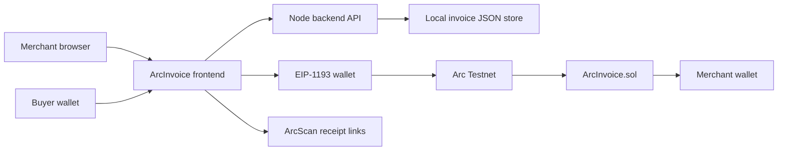

# ArcInvoice

ArcInvoice is a functional MVP for the Arc stablecoin hackathon. It gives small
businesses a lightweight way to issue USDC invoices, register them on Arc, and
produce settlement receipts with ArcScan transaction links.

## Track Fit

- Product: B2B USDC invoice payment and instant settlement.
- User: SMEs, freelancers, agencies, and marketplaces billing international
  customers.
- Core promise: invoice creation, onchain registration, native USDC payment,
  and auditable receipt in one short workflow.

## Circle and Arc Tools

- Arc Testnet: the app connects wallets to Arc Testnet, chain ID `5042002`,
  using `https://rpc.testnet.arc.network`.
- Native USDC: invoice settlement uses Arc native USDC through `msg.value`.
- Smart contracts: `ArcInvoice.sol` emits invoice creation and payment events.
- Circle App Kit: the repo also includes companion Send, Bridge, Swap, and
  Unified Balance pages under `circle/arc/public/` for funding and liquidity
  workflows around the invoice experience.

References:

- Arc network setup: https://docs.arc.io/arc/references/connect-to-arc
- Arc contract addresses: https://docs.arc.io/arc/references/contract-addresses

## Architecture



## MVP Workflow

1. Merchant connects a wallet on Arc Testnet.
2. Merchant creates an invoice through `/api/arcinvoice/invoices`.
3. Merchant deploys or loads the `ArcInvoice` contract.
4. Merchant registers the selected invoice on Arc.
5. Buyer pays the invoice in native USDC.
6. Backend records the tx hash, payer, contract address, and receipt status.

## Local Run

```bash
npm install
npm run compile-custom
npm run build-arc-invoice
npm run typecheck
npm run start-deployer
```

Open `http://localhost:4173`.

The local server exposes:

- `GET /api/arcinvoice/health`
- `GET /api/arcinvoice/invoices`
- `POST /api/arcinvoice/invoices`
- `GET /api/arcinvoice/invoices/:id`
- `PATCH /api/arcinvoice/invoices/:id`

Runtime invoice data is written to `artifacts/arcinvoice-invoices.json`, which
is intentionally ignored by git.

## Demo Script

Minute 0-1:

- Open ArcInvoice.
- Connect MetaMask or another EIP-1193 wallet.
- Show Arc Testnet, wallet address, and native USDC balance.

Minute 1-2:

- Create a 0.25 USDC invoice.
- Deploy or load the ArcInvoice contract.
- Register the invoice on Arc and open the ArcScan link.

Minute 2-3:

- Pay the invoice in native USDC.
- Show the paid receipt, tx hash, payer, and updated volume.
- Explain how the same pattern can support SME billing, marketplace settlement,
  and freelancer payments.

## Commercial Path

ArcInvoice can become a hosted invoice product with:

- hosted merchant profiles and customer payment links;
- Circle Wallets for non-crypto-native buyers;
- App Kit or Gateway for cross-chain USDC liquidity;
- paymaster support for smoother buyer onboarding;
- accounting exports and webhook callbacks for paid invoices.

## Circle Product Feedback

Why these products:

- Arc makes a stablecoin-first invoice flow simple because gas and settlement
  are both denominated in USDC.
- App Kit is a useful companion for funding, moving, and unifying USDC around
  the invoice workflow.

What worked well:

- Arc Testnet is EVM-compatible, so standard Solidity and TypeScript tooling
  works without unusual setup.
- Wallet network setup is straightforward with the published RPC and chain ID.

What could improve:

- More end-to-end examples combining invoices, contract events, App Kit, and
  Circle Wallets would help teams ship commerce MVPs faster.
- Clearer guidance on native USDC decimals and ERC-20 USDC interface behavior
  would reduce testnet implementation uncertainty.

Recommendations:

- Publish a small commerce starter with invoice creation, receipt events,
  payment links, and optional App Kit funding.
- Add a testnet dashboard that groups faucet balance, recent txs, deployed
  contracts, and common contract addresses in one place.
